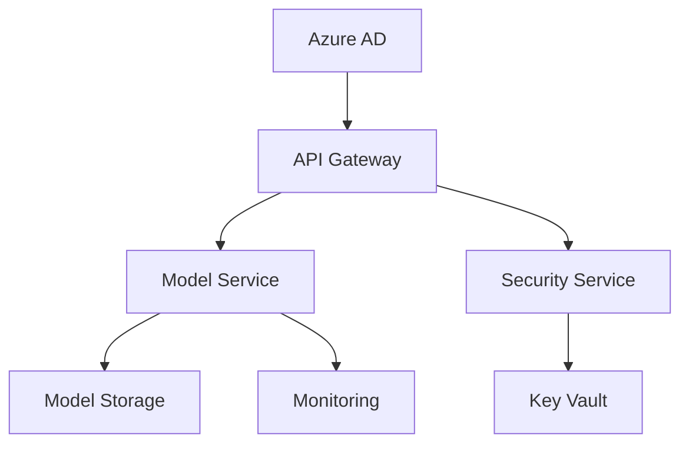

# SecureAI Platform Operations Manual

## System Architecture


## Deployment Procedures

### Initial Setup
1. Infrastructure Deployment
   ```bash
   # Deploy Azure resources
   az deployment group create \
     --resource-group secureai-rg \
     --template-file infra/main.bicep
   ```

2. Security Configuration
   ```bash
   # Configure security settings
   az keyvault update \
     --name secureai-kv \
     --enable-rbac true
   ```

### Maintenance Procedures

1. Backup Verification
   ```bash
   # Verify backups
   az backup job list \
     --resource-group secureai-rg \
     --vault-name secureai-backup
   ```

2. Security Updates
   ```bash
   # Apply security patches
   az aks upgrade \
     --resource-group secureai-rg \
     --name secureai-aks \
     --kubernetes-version 1.25.0
   ```

## Monitoring & Alerting

### Key Metrics
1. System Health
   - API response times
   - Error rates
   - Resource utilization

2. Security Metrics
   - Authentication attempts
   - Authorization failures
   - Encryption status

### Alert Response
1. High Priority
   - Service outages
   - Security breaches
   - Data loss events

2. Medium Priority
   - Performance degradation
   - Resource warnings
   - Minor security events
