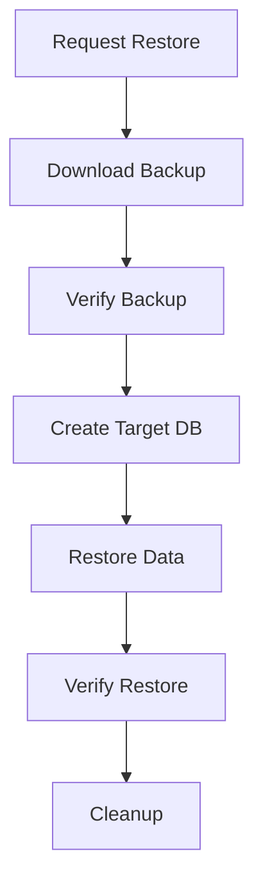

# Database Restore System Documentation

## Overview
The SecureAI Platform Database Restore System provides robust functionality for restoring database backups with comprehensive monitoring, verification, and safety checks.

## Table of Contents
1. [Quick Start](#quick-start)
2. [Architecture](#architecture)
3. [Configuration](#configuration)
4. [Monitoring](#monitoring)
5. [Troubleshooting](#troubleshooting)
6. [Best Practices](#best-practices)

## Quick Start

### Prerequisites
- Access to Google Cloud Storage bucket containing backups
- PostgreSQL client tools installed
- Required environment variables configured

### Basic Restore Operation
```python
from database.restore_manager import RestoreManager

async def restore_database():
    manager = RestoreManager()

    # List available backups
    backups = await manager.list_available_backups()

    # Restore latest backup
    latest_backup = backups[0]['name']
    success = await manager.restore_backup(latest_backup, "target_db")
```

## Architecture

### Components
1. **RestoreManager**: Core component handling restore operations
2. **RestoreMetricsManager**: Metrics collection and monitoring
3. **Verification System**: Ensures backup integrity and restore success
4. **Monitoring System**: Prometheus metrics and Grafana dashboards

### Flow Diagram


## Configuration

### Environment Variables
```env
BACKUP_BUCKET=secureai-backups
BACKUP_RETENTION_DAYS=7
DB_HOST=localhost
DB_USER=postgres
DB_NAME=your_database
```

### Security Configuration
- Role-based access control
- Encryption at rest
- Secure credential management

## Monitoring

### Available Metrics
- `restore_duration_seconds`: Time taken for restore operations
- `restore_size_bytes`: Size of restored database
- `restore_success_total`: Successful restore count
- `restore_failure_total`: Failed restore count
- `restore_verification_total`: Verification results
- `restore_in_progress`: Current restore operations

### Alert Rules
1. **RestoreFailure**: Immediate alert on restore failure
2. **RestoreVerificationFailure**: Alert on verification issues
3. **LongRunningRestore**: Warning for extended operations
4. **MultipleRestoresInProgress**: Concurrent restore warning
5. **HighRestoreFailureRate**: Alert on high failure rates

### Dashboards
- Restore Duration Trends
- Success/Failure Rates
- Verification Results
- Resource Usage

## Troubleshooting

### Common Issues
1. **Backup Verification Failures**
   - Check backup file integrity
   - Verify checksum matches
   - Ensure backup format is correct

2. **Restore Operation Failures**
   - Check database connectivity
   - Verify sufficient disk space
   - Review PostgreSQL logs

3. **Performance Issues**
   - Monitor system resources
   - Check network bandwidth
   - Review concurrent operations

### Logging
```python
# Enable detailed logging
import logging
logging.basicConfig(level=logging.DEBUG)
```

## Best Practices

### Planning Restores
1. Verify backup before restore
2. Schedule during low-traffic periods
3. Ensure sufficient resources
4. Test restore procedure regularly

### Monitoring
1. Set up alerts for critical metrics
2. Monitor restore durations
3. Track success rates
4. Review verification results

### Security
1. Use secure connections
2. Implement access controls
3. Audit restore operations
4. Protect sensitive data

### Performance
1. Optimize restore settings
2. Monitor resource usage
3. Schedule appropriately
4. Clean up temporary files
