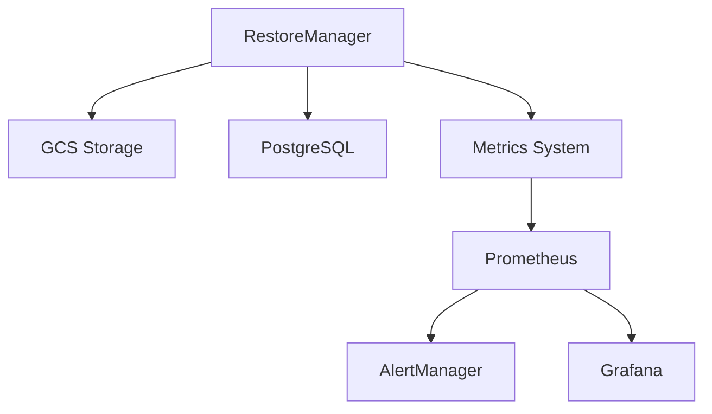

# Technical Reference Documentation

## System Architecture

### Components Overview


### Core Components

#### 1. RestoreManager
```python
class RestoreManager:
    """
    Core component responsible for database restore operations.

    Attributes:
        backup_dir (Path): Directory for temporary backup files
        storage_client (storage.Client): Google Cloud Storage client
        bucket (storage.Bucket): GCS bucket for backups
        metrics (RestoreMetricsManager): Metrics collection
    """
```

#### 2. RestoreMetricsManager
```python
class RestoreMetricsManager:
    """
    Manages metrics collection for restore operations.

    Metrics:
        - restore_duration_seconds
        - restore_size_bytes
        - restore_success_total
        - restore_failure_total
        - restore_verification_total
        - restore_in_progress
    """
```

### Data Flow

1. **Backup Selection**
   ```mermaid
   sequenceDiagram
       Client->>RestoreManager: Request backup list
       RestoreManager->>GCS: List backups
       GCS->>RestoreManager: Return backup metadata
       RestoreManager->>Client: Return filtered list
   ```

2. **Restore Process**
   ```mermaid
   sequenceDiagram
       Client->>RestoreManager: Initiate restore
       RestoreManager->>GCS: Download backup
       RestoreManager->>Metrics: Record start
       RestoreManager->>PostgreSQL: Create database
       RestoreManager->>PostgreSQL: Restore data
       RestoreManager->>Metrics: Record completion
   ```

## API Reference

### RestoreManager API

#### List Backups
```python
async def list_available_backups(self) -> List[Dict]:
    """
    List available database backups.

    Returns:
        List[Dict]: List of backup metadata
        {
            'name': str,
            'size': int,
            'created': datetime,
            'checksum': str
        }

    Raises:
        StorageError: If backup listing fails
    """
```

#### Restore Backup
```python
async def restore_backup(self, backup_name: str, target_db: str) -> bool:
    """
    Restore a database backup.

    Args:
        backup_name (str): Name of backup to restore
        target_db (str): Target database name

    Returns:
        bool: True if restore successful

    Raises:
        RestoreError: If restore operation fails
        ValidationError: If backup verification fails
    """
```

### Metrics API

#### Record Metrics
```python
def record_restore_completion(
    duration: float,
    size: int,
    success: bool,
    failure_reason: str = None
):
    """
    Record restore completion metrics.

    Args:
        duration (float): Time taken in seconds
        size (int): Size in bytes
        success (bool): Whether restore succeeded
        failure_reason (str, optional): Reason for failure
    """
```

## Configuration Reference

### Environment Variables
| Variable | Description | Default | Required |
|----------|-------------|---------|----------|
| BACKUP_BUCKET | GCS bucket name | secureai-backups | Yes |
| BACKUP_RETENTION_DAYS | Days to retain backups | 7 | No |
| DB_HOST | Database host | localhost | Yes |
| DB_USER | Database user | postgres | Yes |
| DB_PASSWORD | Database password | None | Yes |
| DB_NAME | Database name | None | Yes |

### Prometheus Metrics
| Metric | Type | Description | Labels |
|--------|------|-------------|---------|
| restore_duration_seconds | Histogram | Restore duration | None |
| restore_size_bytes | Gauge | Restore size | None |
| restore_success_total | Counter | Successful restores | None |
| restore_failure_total | Counter | Failed restores | failure_reason |
| restore_verification_total | Counter | Verifications | status |
| restore_in_progress | Gauge | Current restores | None |

### Alert Rules
| Alert | Condition | Severity | Description |
|-------|-----------|----------|-------------|
| RestoreFailure | increase(restore_failure_total[1h]) > 0 | Critical | Restore failed |
| RestoreVerificationFailure | increase(restore_verification_total{status="failure"}[1h]) > 0 | Critical | Verification failed |
| LongRunningRestore | restore_duration_seconds > 3600 | Warning | Long restore |
| MultipleRestoresInProgress | restore_in_progress > 1 | Warning | Multiple restores |
| HighRestoreFailureRate | failure_rate > 0.1 | Warning | High failure rate |

## Error Handling

### Error Types
```python
class RestoreError(Exception):
    """Base class for restore errors"""
    pass

class ValidationError(RestoreError):
    """Backup validation failed"""
    pass

class DatabaseError(RestoreError):
    """Database operation failed"""
    pass

class StorageError(RestoreError):
    """Storage operation failed"""
    pass
```

### Error Recovery
1. **Backup Verification Failure**
   - Clean up temporary files
   - Log error details
   - Notify monitoring system
   - Return failure status

2. **Database Restore Failure**
   - Roll back partial restore
   - Clean up target database
   - Log error details
   - Update metrics
   - Return failure status

3. **Storage Operation Failure**
   - Retry with exponential backoff
   - Clean up partial downloads
   - Log error details
   - Update metrics
   - Return failure status

## Performance Considerations

### Resource Requirements
- Minimum 2GB RAM per restore operation
- Temporary storage 2x backup size
- Network bandwidth for backup download
- Database IOPS for restore

### Optimization Strategies
1. **Storage**
   - Use compression for backups
   - Implement streaming restore
   - Clean up temporary files

2. **Database**
   - Optimize PostgreSQL settings
   - Use parallel restore when possible
   - Monitor system resources

3. **Network**
   - Use regional storage buckets
   - Implement retry with backoff
   - Monitor bandwidth usage
