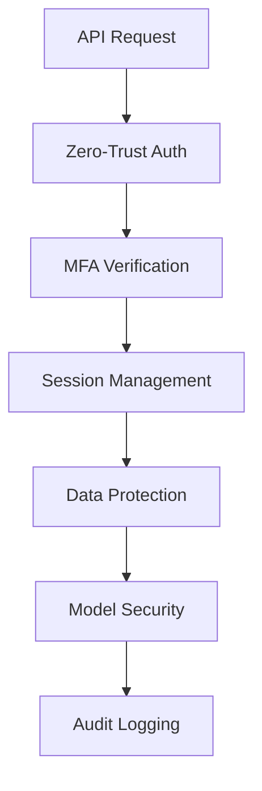

# SecureAI Platform Security Documentation
Version 1.0 | January 2025

## Overview

This document provides comprehensive security documentation for the SecureAI Platform, implementing a zero-trust architecture with enhanced privacy controls and secure model integration.

## Table of Contents

1. [Security Architecture](./architecture.md)
2. [Authentication & Authorization](./auth.md)
3. [Data Protection](./data-protection.md)
4. [Model Security](./model-security.md)
5. [Compliance & Auditing](./compliance.md)
6. [Security Operations](./operations.md)
7. [Incident Response](./incident-response.md)

## Quick Start

### Security Components

### Key Security Features

- Zero-trust authentication with MFA
- Real-time data protection and privacy controls
- Model security validation and monitoring
- Comprehensive audit logging
- Automated compliance checks
- Key rotation and encryption

### Security Contacts

- Security Team: security@secureai.example.com
- Emergency Response: +1-XXX-XXX-XXXX
- Compliance Officer: compliance@secureai.example.com 