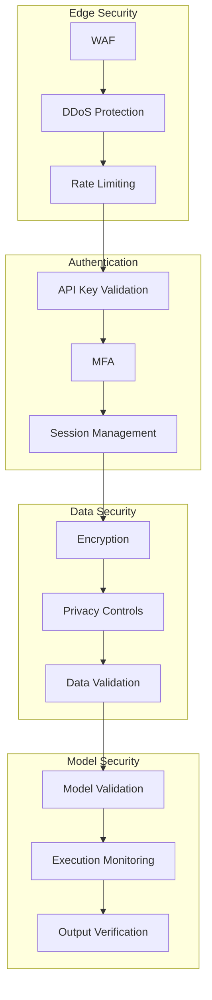

# Security Architecture
Version 1.0 | January 2025

## Zero-Trust Architecture

### Core Principles

1. **Never Trust, Always Verify**
   - Every request is authenticated and authorized
   - Continuous validation throughout request lifecycle
   - Context-aware security decisions

2. **Least Privilege Access**
   - Minimal required permissions
   - Time-bound access
   - Regular permission reviews

### Security Layers



### Implementation Details

1. **Edge Security**
   ```python
   # Rate limiting configuration
   RATE_LIMIT = {
       'window_size': '1m',
       'max_requests': 100,
       'burst_size': 10
   }
   ```

2. **Authentication Flow**
   ```python
   # Authentication process
   async def authenticate_request(request):
       # 1. Validate API key
       await verify_api_key(request.headers['X-API-Key'])
       
       # 2. Check MFA requirement
       if requires_mfa(request.context):
           await verify_mfa(request)
           
       # 3. Create session
       return await create_session(request)
   ```

3. **Data Protection**
   ```python
   # Data protection pipeline
   async def protect_data(data):
       # 1. Scan for sensitive data
       scan_result = await scan_sensitive_data(data)
       
       # 2. Apply privacy controls
       protected_data = await apply_privacy_controls(data, scan_result)
       
       # 3. Encrypt
       return await encrypt_data(protected_data)
   ```

### Security Boundaries

1. **Network Segmentation**
   - Separate VPCs for different components
   - Network policies for pod-to-pod communication
   - Service mesh for encrypted traffic

2. **Access Controls**
   - Role-based access control (RBAC)
   - Network policies
   - Service accounts

3. **Data Isolation**
   - Separate storage for different sensitivity levels
   - Encryption at rest and in transit
   - Key management per tenant 