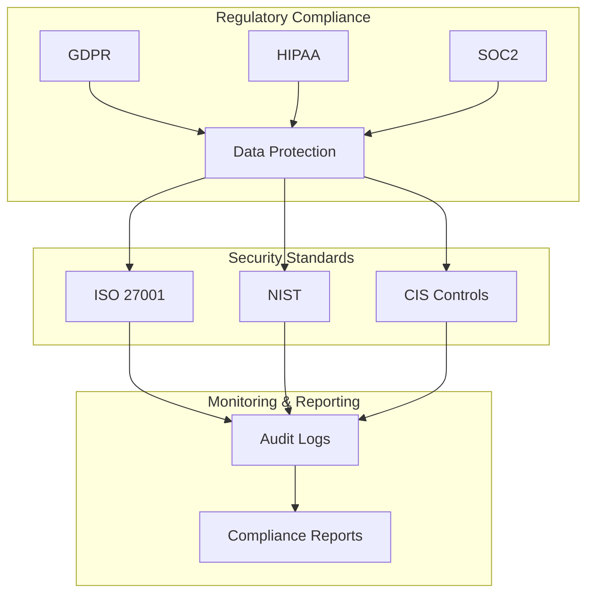

# Compliance & Auditing
Version 1.0 | January 2025

## Overview

The SecureAI Platform implements comprehensive compliance and auditing mechanisms to ensure adherence to regulatory requirements and security standards.

## Compliance Framework



## Compliance Requirements

### 1. Data Protection Regulations

```python
COMPLIANCE_REQUIREMENTS = {
    'GDPR': {
        'data_protection': [
            'encryption_at_rest',
            'encryption_in_transit',
            'data_minimization'
        ],
        'user_rights': [
            'access',
            'rectification',
            'erasure',
            'portability'
        ],
        'processing_records': [
            'purpose',
            'categories',
            'recipients',
            'retention'
        ]
    },
    'HIPAA': {
        'technical_safeguards': [
            'access_control',
            'audit_controls',
            'integrity_controls',
            'transmission_security'
        ],
        'privacy_rules': [
            'minimum_necessary',
            'patient_rights',
            'breach_notification'
        ]
    },
    'SOC2': {
        'security': True,
        'availability': True,
        'processing_integrity': True,
        'confidentiality': True,
        'privacy': True
    }
}
```

### 2. Security Standards Implementation

```python
SECURITY_STANDARDS = {
    'ISO27001': {
        'information_security_policies': True,
        'asset_management': True,
        'access_control': True,
        'cryptography': True,
        'physical_security': True,
        'operations_security': True,
        'communications_security': True
    },
    'NIST': {
        'identify': True,
        'protect': True,
        'detect': True,
        'respond': True,
        'recover': True
    },
    'CIS_Controls': {
        'basic': True,
        'foundational': True,
        'organizational': True
    }
}
```

## Audit System

### 1. Audit Logging

```python
AUDIT_LOGGING = {
    'events': {
        'authentication': {
            'login_attempts': True,
            'mfa_events': True,
            'session_management': True
        },
        'data_access': {
            'read_operations': True,
            'write_operations': True,
            'delete_operations': True
        },
        'model_operations': {
            'model_loading': True,
            'inference_requests': True,
            'model_updates': True
        },
        'security_events': {
            'policy_violations': True,
            'suspicious_activities': True,
            'system_changes': True
        }
    },
    'log_format': {
        'timestamp': True,
        'event_type': True,
        'user_id': True,
        'resource_id': True,
        'action': True,
        'status': True,
        'details': True
    },
    'retention': {
        'active_logs': '90d',
        'archived_logs': '7y',
        'security_events': '10y'
    }
}
```

### 2. Automated Compliance Checks

```python
COMPLIANCE_AUTOMATION = {
    'scheduled_checks': {
        'frequency': '24h',
        'scope': [
            'security_controls',
            'data_protection',
            'access_controls',
            'encryption_status'
        ]
    },
    'real_time_monitoring': {
        'data_access_patterns': True,
        'security_violations': True,
        'system_changes': True
    },
    'reporting': {
        'automated_reports': True,
        'compliance_dashboards': True,
        'alert_generation': True
    }
}
```

## Compliance Monitoring

### 1. Continuous Monitoring

```python
CONTINUOUS_MONITORING = {
    'data_protection': {
        'encryption_status': True,
        'access_patterns': True,
        'data_lifecycle': True
    },
    'security_controls': {
        'authentication_systems': True,
        'authorization_mechanisms': True,
        'security_boundaries': True
    },
    'system_integrity': {
        'configuration_changes': True,
        'system_updates': True,
        'security_patches': True
    }
}
```

### 2. Compliance Reporting

```python
COMPLIANCE_REPORTING = {
    'scheduled_reports': {
        'daily_summary': True,
        'weekly_analysis': True,
        'monthly_compliance': True,
        'quarterly_review': True
    },
    'ad_hoc_reports': {
        'incident_reports': True,
        'audit_findings': True,
        'remediation_tracking': True
    },
    'dashboards': {
        'real_time_compliance': True,
        'trend_analysis': True,
        'risk_indicators': True
    }
}
```

## Incident Response

### 1. Compliance Violations

```python
COMPLIANCE_VIOLATIONS = {
    'detection': {
        'automated_monitoring': True,
        'manual_reporting': True,
        'third_party_notifications': True
    },
    'response': {
        'immediate_actions': [
            'stop_violation',
            'assess_impact',
            'notify_stakeholders'
        ],
        'investigation': [
            'root_cause_analysis',
            'impact_assessment',
            'documentation'
        ],
        'remediation': [
            'corrective_actions',
            'preventive_measures',
            'policy_updates'
        ]
    }
}
```

### 2. Reporting Requirements

```python
REPORTING_REQUIREMENTS = {
    'internal': {
        'immediate_notification': True,
        'incident_reports': True,
        'status_updates': True
    },
    'external': {
        'regulatory_reporting': {
            'gdpr_72h': True,
            'hipaa_60d': True,
            'breach_notifications': True
        },
        'stakeholder_communications': {
            'customer_notifications': True,
            'public_disclosures': True,
            'regulatory_updates': True
        }
    }
} 