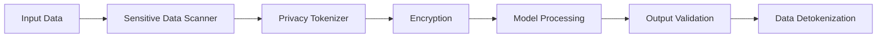

# Data Protection
Version 1.0 | January 2025

## Overview

The SecureAI Platform implements comprehensive data protection measures to ensure the security and privacy of sensitive information throughout its lifecycle.

## Data Protection Pipeline



### Components

1. **Sensitive Data Scanner**
   ```python
   SENSITIVE_DATA_PATTERNS = {
       'pii': {
           'ssn': r'\d{3}-\d{2}-\d{4}',
           'email': r'[a-zA-Z0-9._%+-]+@[a-zA-Z0-9.-]+\.[a-zA-Z]{2,}',
           'phone': r'\b\d{3}[-.]?\d{3}[-.]?\d{4}\b',
           'credit_card': r'\b\d{4}[-. ]?\d{4}[-. ]?\d{4}[-. ]?\d{4}\b'
       },
       'financial': {
           'bank_account': r'\b\d{10,12}\b',
           'routing_number': r'\b\d{9}\b'
       },
       'health': {
           'medical_record': r'MRN[-: ]?\d{6,}',
           'diagnosis_code': r'ICD-\d{1,2}[-: ][A-Z0-9.]{3,}'
       }
   }
   ```

2. **Privacy Tokenization**
   ```python
   TOKENIZATION_CONFIG = {
       'token_format': '<PROTECTED_{category}_{id}>',
       'preservation_rules': {
           'email': ['domain'],
           'phone': ['country_code'],
           'address': ['country', 'state']
       }
   }
   ```

3. **Encryption System**
   ```python
   ENCRYPTION_CONFIG = {
       'algorithm': 'AES-256-GCM',
       'key_rotation': '4h',
       'key_storage': 'azure-key-vault',
       'backup_keys': True
   }
   ```

## Implementation Guidelines

### 1. Data Classification

- **High Sensitivity**
  - Personal Identifiable Information (PII)
  - Financial data
  - Health information
  - Authentication credentials

- **Medium Sensitivity**
  - Business logic
  - Model parameters
  - Usage statistics

- **Low Sensitivity**
  - Public information
  - Aggregated metrics
  - Documentation

### 2. Protection Measures

#### Data at Rest
```python
STORAGE_PROTECTION = {
    'high': {
        'encryption': 'AES-256',
        'key_rotation': '24h',
        'backup': True,
        'audit_logging': True
    },
    'medium': {
        'encryption': 'AES-128',
        'key_rotation': '72h',
        'backup': True,
        'audit_logging': True
    },
    'low': {
        'encryption': None,
        'backup': False,
        'audit_logging': True
    }
}
```

#### Data in Transit
```python
TRANSIT_PROTECTION = {
    'protocols': ['TLS 1.3'],
    'cipher_suites': [
        'TLS_AES_256_GCM_SHA384',
        'TLS_CHACHA20_POLY1305_SHA256'
    ],
    'certificate_rotation': '30d'
}
```

#### Data in Use
```python
RUNTIME_PROTECTION = {
    'memory_encryption': True,
    'secure_enclave': True,
    'runtime_integrity_checks': True
}
```

### 3. Key Management

```python
KEY_MANAGEMENT = {
    'storage': 'Azure Key Vault',
    'rotation_schedule': {
        'encryption_keys': '4h',
        'signing_keys': '24h',
        'master_keys': '90d'
    },
    'backup': {
        'enabled': True,
        'location': 'geo-redundant',
        'frequency': '24h'
    }
}
```

## Compliance Requirements

### 1. Data Retention
```python
RETENTION_POLICIES = {
    'high_sensitivity': '30d',
    'medium_sensitivity': '90d',
    'low_sensitivity': '365d',
    'audit_logs': '7y'
}
```

### 2. Data Deletion
```python
DELETION_PROCEDURES = {
    'soft_delete': {
        'enabled': True,
        'retention': '30d'
    },
    'hard_delete': {
        'method': 'secure_erase',
        'passes': 3,
        'verification': True
    }
}
```

### 3. Audit Requirements
```python
AUDIT_CONFIG = {
    'log_retention': '7y',
    'event_types': [
        'access', 'modification',
        'deletion', 'encryption',
        'key_rotation'
    ],
    'alert_triggers': {
        'unauthorized_access': True,
        'bulk_deletion': True,
        'encryption_failure': True
    }
}
```

## Emergency Procedures

### 1. Data Breach Response
```python
BREACH_RESPONSE = {
    'notification_timeline': '72h',
    'containment_steps': [
        'revoke_access',
        'rotate_keys',
        'isolate_systems'
    ],
    'investigation_procedures': [
        'forensic_analysis',
        'impact_assessment',
        'root_cause_analysis'
    ]
}
```

### 2. Recovery Procedures
```python
RECOVERY_PROCEDURES = {
    'data_restoration': {
        'from_backup': True,
        'integrity_verification': True
    },
    'system_hardening': {
        'security_patches': True,
        'configuration_review': True,
        'access_review': True
    }
}
``` 