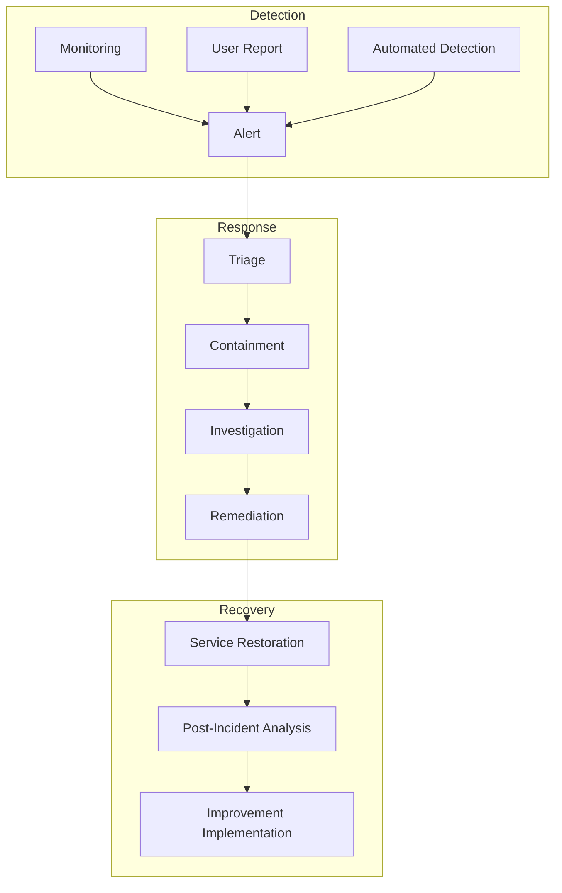

# Incident Response Plan
Version 1.0 | January 2025

## Overview

This document outlines the comprehensive incident response procedures for the SecureAI Platform, ensuring rapid and effective response to security incidents.

## Incident Response Framework



## Incident Classification

### 1. Severity Levels

```python
INCIDENT_SEVERITY = {
    'critical': {
        'description': [
            'Data breach with PII exposure',
            'System-wide security compromise',
            'Critical service outage'
        ],
        'response_time': '15m',
        'notification': ['CISO', 'CTO', 'Legal', 'PR'],
        'update_frequency': '30m'
    },
    'high': {
        'description': [
            'Limited data exposure',
            'Service degradation',
            'Suspected security breach'
        ],
        'response_time': '30m',
        'notification': ['Security Lead', 'Engineering Lead'],
        'update_frequency': '2h'
    },
    'medium': {
        'description': [
            'Suspicious activity',
            'Minor service issues',
            'Policy violations'
        ],
        'response_time': '2h',
        'notification': ['Security Team'],
        'update_frequency': '4h'
    },
    'low': {
        'description': [
            'Minor anomalies',
            'Single user issues',
            'Non-critical alerts'
        ],
        'response_time': '8h',
        'notification': ['Service Desk'],
        'update_frequency': '24h'
    }
}
```

## Response Procedures

### 1. Initial Response

```python
INITIAL_RESPONSE = {
    'triage': {
        'assessment': [
            'Incident verification',
            'Severity classification',
            'Initial scope determination'
        ],
        'notification': [
            'Alert response team',
            'Notify stakeholders',
            'Document initial findings'
        ],
        'immediate_actions': [
            'Preserve evidence',
            'Implement initial containment',
            'Establish communication channels'
        ]
    },
    'documentation': {
        'required_info': [
            'Incident ID',
            'Timestamp',
            'Detection method',
            'Initial assessment',
            'Affected systems',
            'Initial response actions'
        ],
        'communication_templates': {
            'internal_notification': True,
            'stakeholder_update': True,
            'customer_notification': True
        }
    }
}
```

### 2. Containment Strategy

```python
CONTAINMENT_PROCEDURES = {
    'immediate_actions': {
        'system_isolation': {
            'network_segmentation': True,
            'service_suspension': True,
            'access_restriction': True
        },
        'data_protection': {
            'encryption_verification': True,
            'backup_isolation': True,
            'access_logging': True
        },
        'user_access': {
            'credential_reset': True,
            'session_termination': True,
            'access_review': True
        }
    },
    'evidence_preservation': {
        'system_logs': True,
        'network_traffic': True,
        'access_records': True,
        'system_state': True
    }
}
```

### 3. Investigation Process

```python
INVESTIGATION_PROCEDURES = {
    'forensic_analysis': {
        'system_analysis': {
            'log_analysis': True,
            'memory_analysis': True,
            'disk_forensics': True
        },
        'network_analysis': {
            'traffic_analysis': True,
            'connection_logging': True,
            'packet_capture': True
        },
        'timeline_reconstruction': {
            'event_correlation': True,
            'activity_mapping': True,
            'impact_assessment': True
        }
    },
    'documentation': {
        'evidence_collection': True,
        'chain_of_custody': True,
        'analysis_findings': True
    }
}
```

## Recovery Procedures

### 1. Service Restoration

```python
SERVICE_RESTORATION = {
    'verification': {
        'security_checks': {
            'vulnerability_scan': True,
            'penetration_test': True,
            'configuration_review': True
        },
        'functionality_testing': {
            'service_checks': True,
            'integration_testing': True,
            'performance_testing': True
        }
    },
    'restoration_steps': {
        'system_recovery': {
            'clean_system_restore': True,
            'patch_application': True,
            'configuration_restore': True
        },
        'data_recovery': {
            'backup_restoration': True,
            'integrity_verification': True,
            'consistency_check': True
        }
    }
}
```

### 2. Post-Incident Analysis

```python
POST_INCIDENT_ANALYSIS = {
    'review_areas': {
        'incident_handling': {
            'response_effectiveness': True,
            'procedure_compliance': True,
            'communication_efficiency': True
        },
        'root_cause': {
            'vulnerability_analysis': True,
            'attack_vector_identification': True,
            'control_effectiveness': True
        },
        'impact_assessment': {
            'service_disruption': True,
            'data_exposure': True,
            'customer_impact': True,
            'financial_impact': True
        }
    },
    'documentation': {
        'incident_report': {
            'executive_summary': True,
            'technical_details': True,
            'timeline': True,
            'recommendations': True
        },
        'lessons_learned': {
            'process_improvements': True,
            'control_enhancements': True,
            'training_needs': True
        }
    }
}
```

## Communication Plan

### 1. Notification Matrix

```python
NOTIFICATION_MATRIX = {
    'internal': {
        'security_team': {
            'method': ['slack', 'email', 'phone'],
            'timing': 'immediate',
            'template': 'technical_detail'
        },
        'management': {
            'method': ['email', 'phone'],
            'timing': 'severity_based',
            'template': 'executive_summary'
        },
        'employees': {
            'method': ['email'],
            'timing': 'after_containment',
            'template': 'general_advisory'
        }
    },
    'external': {
        'customers': {
            'method': ['email', 'dashboard'],
            'timing': 'after_assessment',
            'template': 'customer_notice'
        },
        'regulators': {
            'method': ['formal_letter', 'portal'],
            'timing': 'as_required',
            'template': 'regulatory_notice'
        },
        'public': {
            'method': ['website', 'press'],
            'timing': 'as_needed',
            'template': 'public_statement'
        }
    }
}
```

### 2. Communication Templates

```python
COMMUNICATION_TEMPLATES = {
    'initial_notification': {
        'internal': {
            'subject': 'Security Incident Alert - [Severity] - [ID]',
            'content': [
                'Incident Description',
                'Current Status',
                'Initial Impact Assessment',
                'Response Actions',
                'Next Steps'
            ]
        },
        'customer': {
            'subject': 'Security Notice - [Service] Status Update',
            'content': [
                'Issue Overview',
                'Current Status',
                'Customer Impact',
                'Actions Taken',
                'Next Steps',
                'Contact Information'
            ]
        }
    }
}
``` 