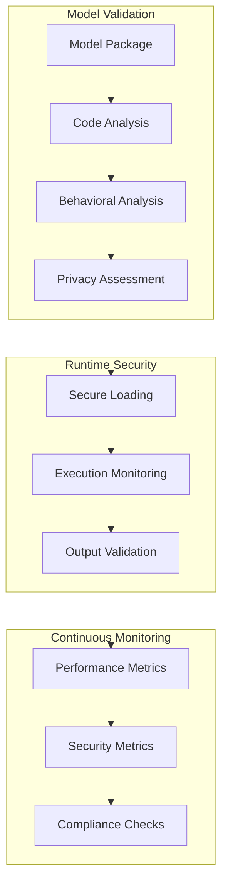

# Model Security
Version 1.0 | January 2025

## Overview

The SecureAI Platform implements comprehensive security measures for AI model management, validation, and execution.

## Model Security Architecture



## Security Components

### 1. Model Validation Pipeline

```python
MODEL_VALIDATION_CONFIG = {
    'security_checks': {
        'code_analysis': {
            'vulnerability_scan': True,
            'dependency_check': True,
            'backdoor_detection': True,
            'code_signing_verification': True
        },
        'behavioral_analysis': {
            'input_validation': True,
            'output_stability': True,
            'resource_usage': True,
            'performance_profiling': True
        },
        'privacy_assessment': {
            'data_collection': True,
            'processing_transparency': True,
            'user_control': True
        }
    },
    'validation_thresholds': {
        'security_score': 0.8,
        'privacy_score': 0.85,
        'performance_score': 0.75
    }
}
```

### 2. Runtime Security Controls

```python
RUNTIME_SECURITY = {
    'isolation': {
        'container_security': True,
        'memory_isolation': True,
        'network_isolation': True
    },
    'monitoring': {
        'resource_usage': True,
        'behavior_analysis': True,
        'anomaly_detection': True
    },
    'input_validation': {
        'sanitization': True,
        'size_limits': True,
        'format_verification': True
    },
    'output_validation': {
        'content_filtering': True,
        'privacy_check': True,
        'security_scan': True
    }
}
```

### 3. Model Access Control

```python
MODEL_ACCESS_CONTROL = {
    'authentication': {
        'api_key_required': True,
        'mfa_for_sensitive_ops': True,
        'session_validation': True
    },
    'authorization': {
        'role_based_access': True,
        'model_specific_permissions': True,
        'usage_quotas': True
    },
    'audit_logging': {
        'access_logs': True,
        'operation_logs': True,
        'security_events': True
    }
}
```

## Implementation Guidelines

### 1. Model Registration Process

```python
async def register_model(model_package: Dict) -> ValidationResult:
    """
    Comprehensive model registration with security validation
    """
    # 1. Initial validation
    validation = await validate_model_package(model_package)
    if not validation.passed:
        raise SecurityException(validation.details)
        
    # 2. Security scanning
    security_scan = await scan_model_security(model_package)
    if not security_scan.passed:
        raise SecurityException(security_scan.details)
        
    # 3. Privacy assessment
    privacy_check = await assess_privacy_impact(model_package)
    if not privacy_check.passed:
        raise SecurityException(privacy_check.details)
        
    # 4. Register model
    return await complete_registration(model_package, {
        'validation': validation,
        'security': security_scan,
        'privacy': privacy_check
    })
```

### 2. Secure Model Execution

```python
MODEL_EXECUTION_SECURITY = {
    'pre_execution': {
        'input_validation': True,
        'resource_check': True,
        'permission_verification': True
    },
    'execution': {
        'isolation': True,
        'monitoring': True,
        'resource_limits': True
    },
    'post_execution': {
        'output_validation': True,
        'resource_cleanup': True,
        'audit_logging': True
    }
}
```

### 3. Model Update Security

```python
MODEL_UPDATE_SECURITY = {
    'validation': {
        'signature_verification': True,
        'version_control': True,
        'compatibility_check': True
    },
    'deployment': {
        'rollback_capability': True,
        'gradual_rollout': True,
        'health_monitoring': True
    },
    'verification': {
        'security_regression': True,
        'performance_impact': True,
        'compliance_check': True
    }
}
```

## Security Monitoring

### 1. Performance Metrics

```python
PERFORMANCE_MONITORING = {
    'metrics': {
        'latency': True,
        'throughput': True,
        'error_rate': True,
        'resource_usage': True
    },
    'thresholds': {
        'max_latency': '500ms',
        'error_rate': '0.1%',
        'resource_usage': '80%'
    },
    'alerts': {
        'threshold_breach': True,
        'anomaly_detection': True,
        'trend_analysis': True
    }
}
```

### 2. Security Metrics

```python
SECURITY_MONITORING = {
    'metrics': {
        'failed_requests': True,
        'unauthorized_access': True,
        'input_violations': True,
        'output_violations': True
    },
    'analysis': {
        'pattern_detection': True,
        'threat_analysis': True,
        'risk_assessment': True
    },
    'response': {
        'automatic_blocking': True,
        'alert_generation': True,
        'incident_creation': True
    }
}
```

## Emergency Procedures

### 1. Model Security Incident Response

```python
MODEL_INCIDENT_RESPONSE = {
    'triggers': {
        'security_breach': True,
        'performance_degradation': True,
        'compliance_violation': True
    },
    'actions': {
        'model_suspension': True,
        'investigation': True,
        'stakeholder_notification': True
    },
    'recovery': {
        'root_cause_analysis': True,
        'remediation_plan': True,
        'verification': True
    }
}
```

### 2. Model Recovery Procedures

```python
MODEL_RECOVERY = {
    'rollback': {
        'previous_version': True,
        'data_recovery': True,
        'configuration_restore': True
    },
    'verification': {
        'security_check': True,
        'performance_check': True,
        'compliance_check': True
    },
    'documentation': {
        'incident_report': True,
        'lessons_learned': True,
        'procedure_updates': True
    }
}
``` 