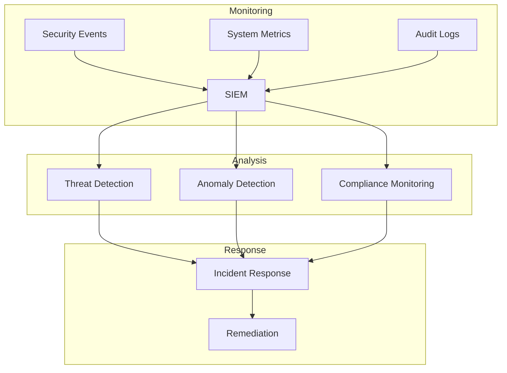

# Security Operations
Version 1.0 | January 2025

## Overview

This document outlines the security operations procedures and practices for the SecureAI Platform, ensuring continuous security monitoring, incident response, and system maintenance.

## Security Operations Center (SOC)



## Operational Procedures

### 1. Security Monitoring

```python
SECURITY_MONITORING = {
    'real_time_monitoring': {
        'system_health': {
            'cpu_usage': True,
            'memory_usage': True,
            'disk_usage': True,
            'network_traffic': True
        },
        'security_events': {
            'authentication_attempts': True,
            'access_violations': True,
            'system_changes': True,
            'api_usage': True
        },
        'model_behavior': {
            'inference_patterns': True,
            'resource_consumption': True,
            'error_rates': True,
            'response_times': True
        }
    },
    'alerting_thresholds': {
        'critical': {
            'response_time': '5m',
            'escalation': True,
            'notification_channels': ['phone', 'email', 'slack']
        },
        'high': {
            'response_time': '15m',
            'escalation': True,
            'notification_channels': ['email', 'slack']
        },
        'medium': {
            'response_time': '1h',
            'escalation': False,
            'notification_channels': ['email']
        }
    }
}
```

### 2. Incident Management

```python
INCIDENT_MANAGEMENT = {
    'classification': {
        'severity_levels': {
            'critical': {
                'description': 'System-wide security breach or outage',
                'response_time': '15m',
                'resolution_time': '2h'
            },
            'high': {
                'description': 'Limited security breach or major functionality affected',
                'response_time': '30m',
                'resolution_time': '4h'
            },
            'medium': {
                'description': 'Potential security threat or minor functionality affected',
                'response_time': '2h',
                'resolution_time': '8h'
            },
            'low': {
                'description': 'Minor issues with no immediate security impact',
                'response_time': '4h',
                'resolution_time': '24h'
            }
        }
    },
    'response_procedures': {
        'initial_assessment': {
            'impact_analysis': True,
            'scope_determination': True,
            'resource_allocation': True
        },
        'containment': {
            'isolation_procedures': True,
            'evidence_preservation': True,
            'service_continuity': True
        },
        'investigation': {
            'root_cause_analysis': True,
            'forensic_analysis': True,
            'impact_assessment': True
        },
        'remediation': {
            'immediate_actions': True,
            'long_term_fixes': True,
            'verification': True
        }
    }
}
```

### 3. Change Management

```python
CHANGE_MANAGEMENT = {
    'types': {
        'emergency': {
            'approval_process': 'expedited',
            'documentation': 'post-implementation',
            'testing': 'limited'
        },
        'standard': {
            'approval_process': 'full',
            'documentation': 'pre-implementation',
            'testing': 'comprehensive'
        },
        'routine': {
            'approval_process': 'automated',
            'documentation': 'template',
            'testing': 'standard'
        }
    },
    'procedures': {
        'request': {
            'documentation': True,
            'risk_assessment': True,
            'impact_analysis': True
        },
        'approval': {
            'technical_review': True,
            'security_review': True,
            'business_approval': True
        },
        'implementation': {
            'testing': True,
            'backup': True,
            'rollback_plan': True
        },
        'verification': {
            'testing': True,
            'monitoring': True,
            'documentation': True
        }
    }
}
```

## Maintenance Procedures

### 1. System Updates

```python
SYSTEM_MAINTENANCE = {
    'scheduled_maintenance': {
        'frequency': 'weekly',
        'window': '4h',
        'notification_period': '7d',
        'procedures': {
            'backup': True,
            'testing': True,
            'rollback': True
        }
    },
    'security_patches': {
        'critical': {
            'implementation_time': '24h',
            'testing_required': 'minimal',
            'approval_process': 'expedited'
        },
        'high': {
            'implementation_time': '72h',
            'testing_required': 'standard',
            'approval_process': 'standard'
        },
        'medium': {
            'implementation_time': '7d',
            'testing_required': 'full',
            'approval_process': 'standard'
        }
    }
}
```

### 2. Backup and Recovery

```python
BACKUP_PROCEDURES = {
    'types': {
        'full': {
            'frequency': 'weekly',
            'retention': '90d',
            'verification': True
        },
        'incremental': {
            'frequency': 'daily',
            'retention': '30d',
            'verification': True
        },
        'configuration': {
            'frequency': 'on-change',
            'retention': '365d',
            'verification': True
        }
    },
    'storage': {
        'primary': {
            'type': 'cloud',
            'encryption': True,
            'redundancy': True
        },
        'secondary': {
            'type': 'offsite',
            'encryption': True,
            'redundancy': True
        }
    },
    'testing': {
        'frequency': 'monthly',
        'scope': 'full-recovery',
        'documentation': True
    }
}
```

## Security Metrics

### 1. Key Performance Indicators (KPIs)

```python
SECURITY_KPIS = {
    'operational': {
        'incident_response_time': {
            'target': '15m',
            'threshold': '30m'
        },
        'system_uptime': {
            'target': '99.99%',
            'threshold': '99.9%'
        },
        'patch_implementation_time': {
            'target': '24h',
            'threshold': '48h'
        }
    },
    'security': {
        'failed_access_attempts': {
            'target': '<5/day',
            'threshold': '10/day'
        },
        'security_incidents': {
            'target': '0/month',
            'threshold': '2/month'
        },
        'vulnerability_resolution': {
            'critical': '24h',
            'high': '72h',
            'medium': '7d'
        }
    }
}
```

### 2. Reporting

```python
OPERATIONAL_REPORTING = {
    'daily': {
        'security_events': True,
        'system_health': True,
        'incident_summary': True
    },
    'weekly': {
        'performance_metrics': True,
        'security_trends': True,
        'resource_utilization': True
    },
    'monthly': {
        'compliance_status': True,
        'security_posture': True,
        'risk_assessment': True
    },
    'quarterly': {
        'strategic_review': True,
        'improvement_plans': True,
        'resource_planning': True
    }
}
``` 